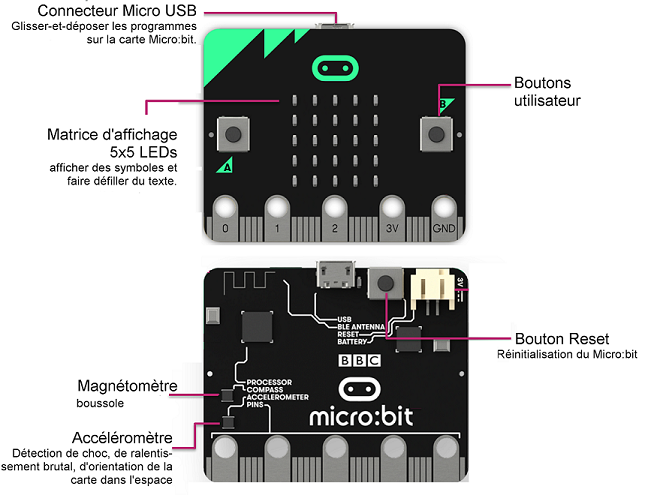
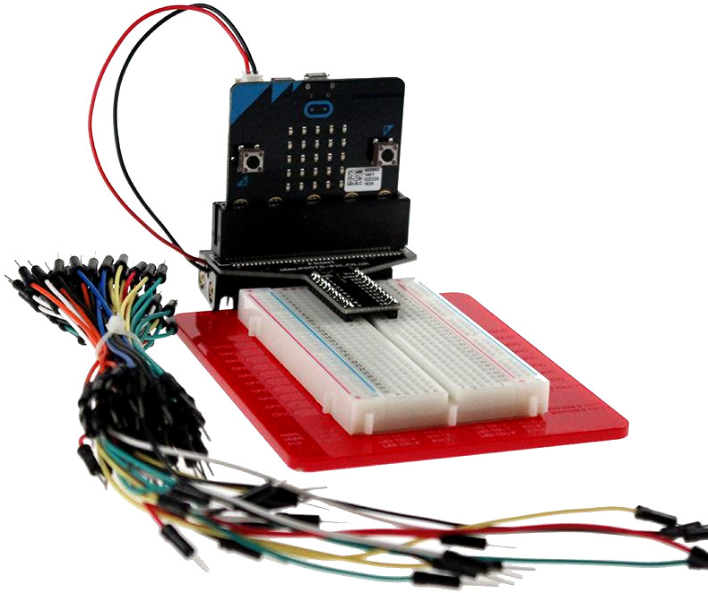
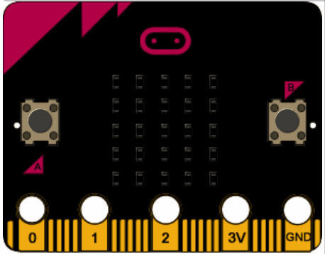
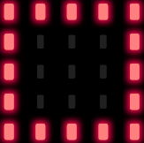

# Programmation BBC micro:bit

## Mise en situation

{ .center}

???+ info "Kesako ? ..."
    { align=left width=70% }
     

    BBC micro:bit est un mini-ordinateur programmable de poche (une carte à microcontrôleur) conçu pour développer votre créativité avec la technologie.

     

    Ce petit appareil intègre beaucoup de fonctionnalités : il a 25 LED rouges qui peuvent afficher des messages, et deux boutons programmables pouvant être utilisés pour contrôler des jeux, ou, par exemple, faire une pause et sauter des chansons sur une liste de lecture ;

    Le BBC micro:bit peut détecter le mouvement, la température, la  luminosité, et vous dire dans quelle direction vous vous dirigez ;
    
    Il peut aussi utiliser une connexion Bluetooth à faible énergie pour interagir avec d'autres appareils et Internet.

    { align=right width=70%}
    
     
    Ce petit ordinateur possède la dernière technologie qui équipe les appareils modernes : téléphones mobiles, réfrigérateurs, montres intelligentes, alarmes antivol, robots, etc...

    Ainsi, il s'apparente à ce que l'on nomme l'Internet des objets : Internet of Things, abrégé IoT.

    Grâce à la connexion à l'IoT, nous pouvons interagir avec un large éventail de capteurs à travers le monde entier en temps réel et nous pouvons maintenant prendre des décisions intelligentes en utilisant nos appareils.

     
    
    Un micro:bit est à la fois autonome et extensible. En plus d'utiliser ses LED intégrées, boutons et capteurs, nous pouvons élargir sa gamme de fonctions en l'insérant dans un connecteur comme ci-contre.

    Donc finalement, micro:bit est tout ce que vous pouvez imaginer. Vous pouvez le transformer en votre dispositif de messagerie, console de jeu, vêtement intelligent, alarme antivol, contrôleur de maison intelligente...  
    A peu près tout ce que votre imagination peut créer en utilisant des capteurs supplémentaires, en réalisant un boitier ou un support pour la carte, et en programmant son microcontroleur.

???+ info "Historique ..."

    La BBC a initié en 2015 le projet Micro:bit, qui se veut être un nano-ordinateur à carte unique à processeur ARM destiné à l’éducation.  
    L’objectif de cette dernière : fournir à chaque écolier de 12 ans (« year 7 ») un support amusant et facile à utiliser.

    Au début des années 80, le groupe de chaînes publiques au Royaume-Uni, la « British Broadcasting Corporation », dite BBC, lança un appel à projet pour créer un ordinateur éducatif à destination des écoliers et des écoles. Une jeune entreprise de Cambridge « Acorn » (« gland » en anglais) fut retenue pour créer cette plateforme. Le « BBC Micro » était né. Dans la même période, ici en France, nous avons connu une initiative comparable avec le Plan Informatique pour Tous basé sur des micro-ordinateurs Thomson MO5 et TO7.

    Plus récemment, quand les membres fondateurs du Raspberry Pi commencèrent à concrétiser leurs rêves d’un nano-ordinateur éducatif, ils voulurent y inscrire en guise de clin d’œil le label « BBC ». Ce droit ne leur fut pas octroyé ; néanmoins un journaliste high-tech de la célèbre « Corporation » sur son blog et sur la chaîne YouTube leur donna un coup de projecteur qui lancera le mouvement autour du Raspberry Pi.
    
    L’histoire se répète, en 2012, trente ans plus tard, la BBC s’est « remis dans le bain » en lançant un objectif très ambitieux : envisager un « ordinateur de poche programmable permettant aux enfants d’explorer la créativité technologique ». Elle voulait formuler une réponse à la fracture numérique et aux lacunes perçues des compétences informatiques des citoyens. Dans l’environnement fertile des startups technologiques du Royaume Uni et inspiré par l’énergie des « makers » et « programmeurs » autour des cartes « hackables » comme l’Arduino, le Raspberry Pi, Beaglebone et bien d’autres, la BBC a de nouveau monté une initiative d’éducation numérique dans la continuité du projet « Make It Digital » (créer le numérique). Ils ont su rapidement rassembler une trentaine de partenaires et des industriels. Aujourd’hui, ces partenaires sont réunis dans la Fondation Micro:bit.

## Programmation

Il existe différentes façon de programmer la carte BBC micro:bit, nous allons utiliser l'éditeur en ligne de [vittascience](https://fr.vittascience.com/microbit/?mode=mixed&console=bottom&toolbox=vittascience&simu=1){target=_blank}

<figure>
<a href="https://fr.vittascience.com/microbit/?mode=mixed&console=bottom&toolbox=vittascience&simu=1" target="_blank"><iframe width='1080' height='720' allowfullscreen frameborder='0' style='border:1px #d6d6d6 solid;' src="https://fr.vittascience.com/microbit/?link=61ae30ba1701d&mode=mixed&simu=1&embed=1"></iframe></a>
</figure>

## Défis à relever

### Smiley

S'inscrire sur [vittascience](https://fr.vittascience.com/microbit/?mode=mixed&console=bottom&toolbox=vittascience&simu=1){target=_blank} et faire afficher un Smiley sur la matrice des 25 Leds...

{ .center}

### Coeur clignotant

Modifier le programme pour qu'après la phase de démarrage du BBC micro:bit la matrice de 25 LEDs affiche alternativement les 2 images de coeur suivantes :

{ .center}

> La fonction `sleep(t)` met en pause l’exécution pendant `t` millisecondes.  
> Exemple : `sleep(1000)` suspend l’exécution pendant 1 seconde.

### Feux d'artifice

Créer une autre séquence animée simulant un feux d'artifice comme par exemple :

<figure>
  <video width="320" height="240" autoplay loop>
  <source src="images/bbc-feu.mp4" type="video/mp4">  
  Your browser does not support the video tag.
  </video>
</figure>

### Pluie

- Représenter une goutte d’eau qui tombe dans la 1ère colonne.

{ .center}

> La fonction `display.set_pixel(x,y,i)` permet d’allumer la LED de la colonne `x` (nombre entre 0 et 4) et de la ligne `y` (nombre entre 0 et 4) avec une intensité `i` (nombre entre 0 et 9).  
> Exemple : `display.set_pixel(1,2,9)` allume la LED située à la colonne 1 de la ligne 2 avec l’intensité 9.

- Faire tomber dix gouttes de suite dans la 1ère colonne.

- Faire tomber une goutte une fois dans chaque colonne.

{ .center}

- Faire tomber dix fois une goutte de pluie dans des colonnes choisies aléatoirement.

> La fonction `randint(x,y)` retourne un nombre entier aléatoire compris entre les nombres entiers x et y inclus. Pour pourvoir utiliser cette fonction, il faut ajouter from random import * au début du programme.  
> Exemple: `randint(0,10)` retourne un nombre aléatoire compris entre 0 et 10.

### Pierre, feuille, ciseau

Développer un programme pour qu'après avoir été secoué la carte BBC micro:bit affiche de façon aléatoire l'un des trois symboles suivants correspondant respectivement à une feuille, une pierre, ou des ciseaux.

{ .center}
{ .center}
{ .center}

### Passer au réel

Connecter un BBC micro:bit pour expérimenter l'un ou l'autre de vos programmes sur cette carte physique.

### Autres défis

Essayer d'autres choses en vous inspirant par exemple de :

<ul>
    <li>
      <a href="https://projects.raspberrypi.org/fr-FR/projects/interactive-badge">Badge Interactif</a>
    </li>
    <li>
      <a href="https://projects.raspberrypi.org/fr-FR/projects/frustration">Frustration</a>
    </li>
    <li>
      <a href="https://projects.raspberrypi.org/fr-FR/projects/fortune-teller">Diseuse de bonne aventure</a>
    </li>
    <li>
      <a href="https://projects.raspberrypi.org/fr-FR/projects/against-the-clock">Contre la montre</a>
    </li>
    <li>
      <a href="https://projects.raspberrypi.org/fr-FR/projects/rate-your-mates">Note tes potes</a>
    </li>
    <li>
      <a href="https://projects.raspberrypi.org/fr-FR/projects/reaction">Réflexes</a>
    </li>
  </ul>  

### Prolongements

Pour aller plus loins en programmation Python avec la carte BBC micro:bit :

- <https://matthieu-branthome.github.io/activite/#d%C3%A9fi-1-le-smiley>

<!-- 
http://2si.si.lycee.ecmorlaix.fr/Robotique/BBCmicrobit.html
 -->
